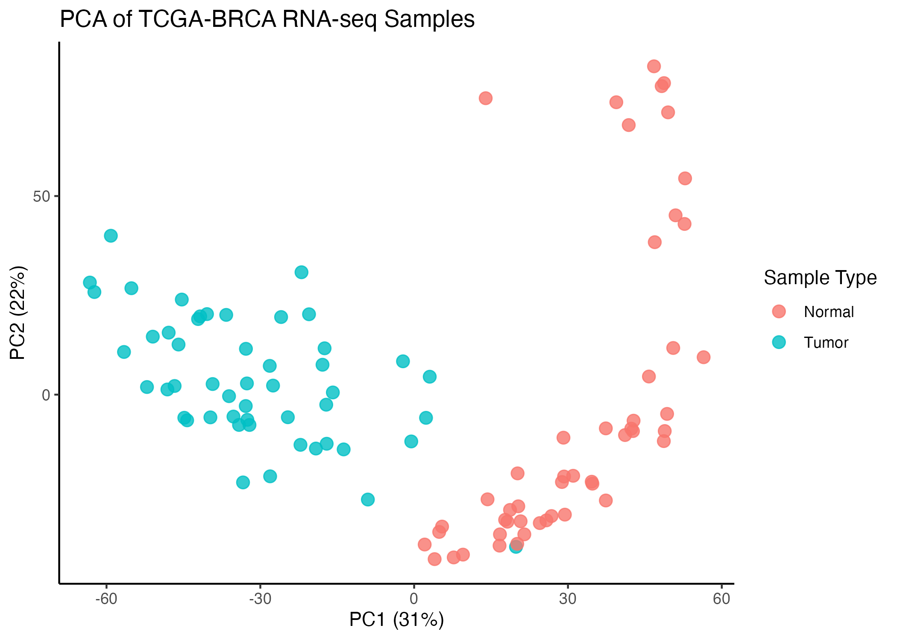
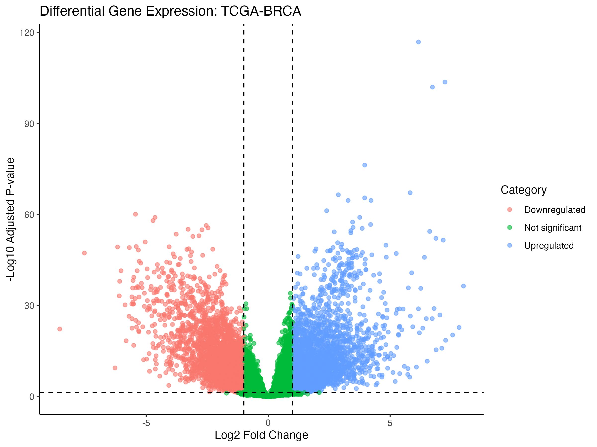
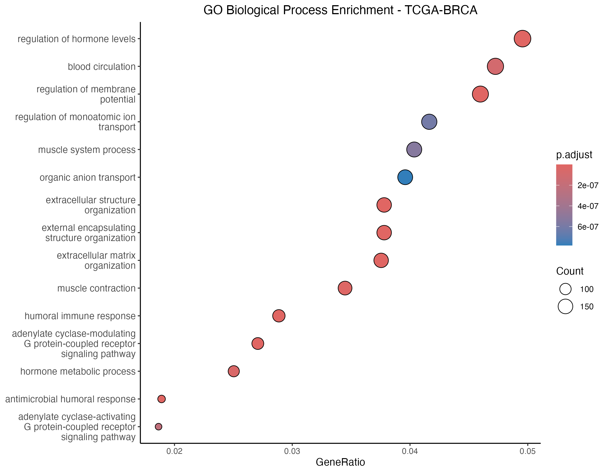
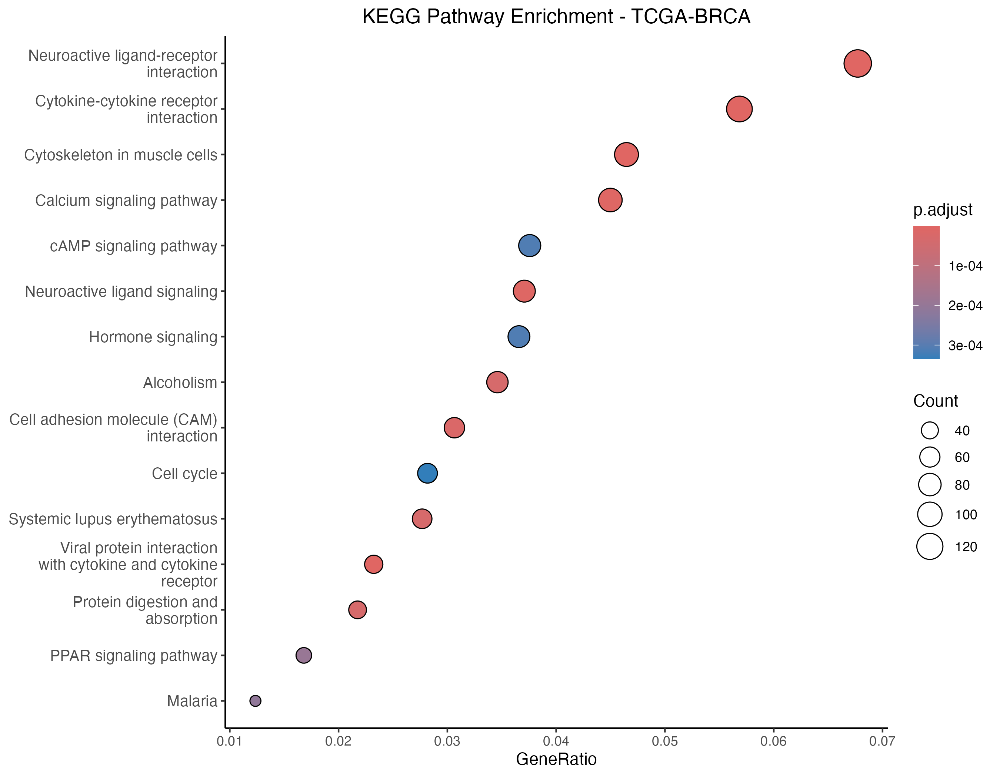
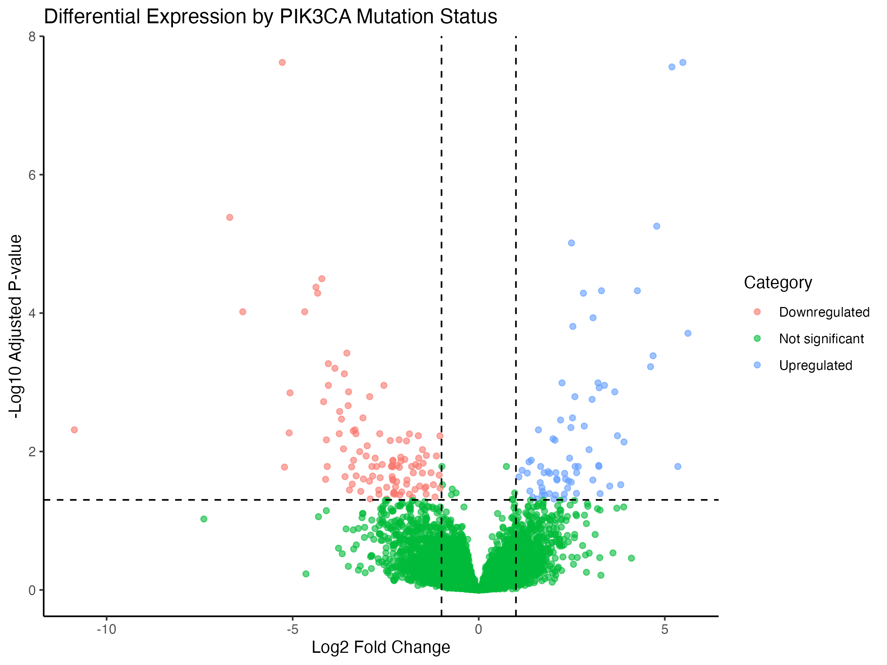
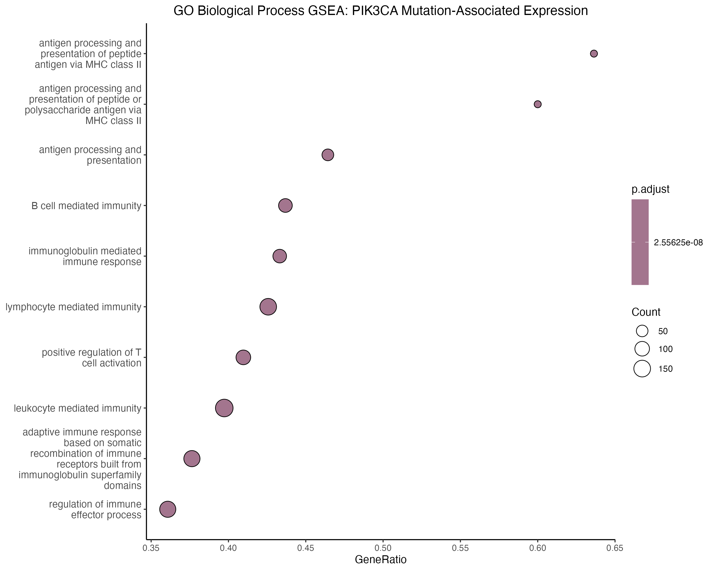
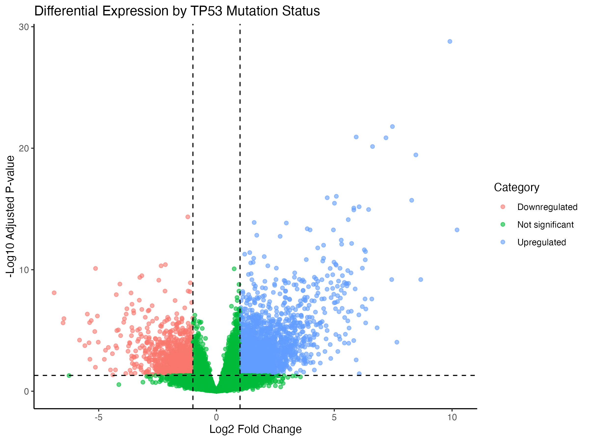
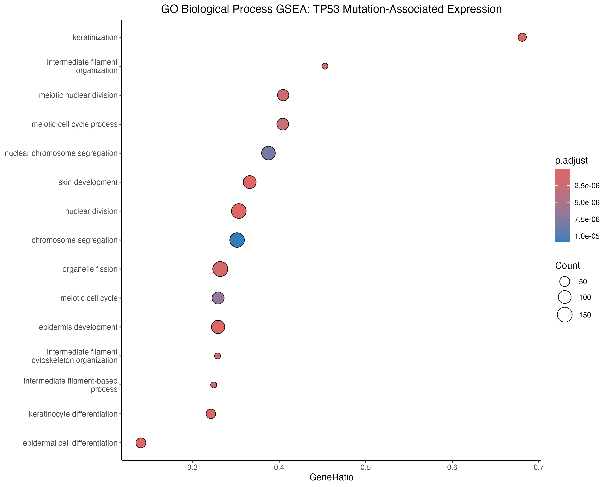

# TCGA-BRCA RNA-seq Analysis

A computational analysis of TCGA Breast Invasive Carcinoma (BRCA) RNA-seq data integrating differential gene expression, pathway enrichment, and mutation-associated expression analysis.

## Overview

This project uses RNA-seq data from the TCGA-BRCA cohort to investigate transcriptional differences between breast tumor and normal tissue and to explore how common somatic mutations are associated with gene-expression programs.

The analysis was performed in R using data accessed through the Genomic Data Commons (GDC) and `TCGAbiolinks`.

## Objectives

- Compare gene expression between breast tumor and normal tissue.
- Identify differentially expressed genes using DESeq2.
- Explore sample-level transcriptional variation using PCA.
- Identify enriched biological processes and pathways using GO and KEGG analysis.
- Examine gene-expression differences associated with PIK3CA and TP53 mutation status.
- Use GSEA to characterize biological programs associated with mutation status.
- Generate reproducible analysis scripts and publication-style visualizations.

## Analysis Workflow

TCGA-BRCA RNA-seq
→ 100-sample balanced cohort
→ Gene filtering
→ DESeq2 differential expression
→ PCA and volcano plot analysis
→ GO and KEGG enrichment
→ Somatic mutation profiling
→ PIK3CA and TP53 mutant vs wild-type analysis
→ GSEA

## Cohort

RNA-seq data were obtained from the TCGA-BRCA project through the GDC using `TCGAbiolinks`.

The final expression cohort consisted of 100 samples:

| Sample type | Number of samples |
|---|---:|
| Primary Tumor | 50 |
| Solid Tissue Normal | 50 |
| **Total** | **100** |

The cohort was selected using a fixed random seed (`set.seed(42)`) to make the sample selection reproducible.

### Gene filtering

The unstranded raw count assay from the GDC STAR-Counts workflow was used.

Genes were retained if they had a count of at least 10 in at least 10 samples.

After filtering:

- 26,344 genes
- 100 samples

## Differential Expression

Differential expression between tumor and normal tissue was performed using **DESeq2**.

The model used:

- Reference group: Normal
- Comparison: Tumor vs Normal
- Multiple-testing correction: Benjamini-Hochberg

Using an adjusted p-value threshold of 0.05 and an absolute log2 fold-change threshold of 1, **6,718 genes** were identified as significantly differentially expressed.

The strongest signals included genes associated with extracellular matrix remodeling, stromal biology, and proliferative programs.

### PCA

Variance-stabilizing transformation was applied before PCA.

The first two principal components explained approximately 53% of the total variance:

- PC1: 31%
- PC2: 22%

Tumor and normal samples showed clear separation in transcriptional space.

### Differential Expression Volcano Plot

## Pathway Enrichment

Differentially expressed genes were analyzed using:

- Gene Ontology (GO) enrichment
- KEGG pathway enrichment

The enriched pathways highlighted biological processes involving extracellular matrix organization, cell adhesion, cytokine signaling, calcium signaling, immune-related processes, and cell-cycle regulation.

### GO Enrichment

### KEGG Enrichment

## Somatic Mutation Analysis

Somatic mutation data were used to investigate mutation-associated transcriptional differences within the tumor cohort.

Frequently mutated genes included:

- **PIK3CA**
- **TP53**
- **TTN**
- **MAP3K1**
- **MUC16**
- **GATA3**
- **CDH1**

Mutation information was matched to the RNA-seq samples at the patient level.

Mutation data were available for **46 of the 50 selected tumor patients**. Therefore, mutation-associated expression analyses were restricted to these 46 matched tumor samples.

## PIK3CA Mutation Analysis

PIK3CA-mutant and PIK3CA-wild-type tumors were compared using DESeq2.

The analysis identified mutation-associated differences in gene expression, with GSEA highlighting immune-related transcriptional programs.

Prominent enriched processes included:

- Antigen processing and presentation
- MHC class II-associated immune responses
- B-cell-mediated immunity
- Immunoglobulin-mediated immune responses
- Lymphocyte and leukocyte-associated processes

### PIK3CA Differential Expression

### PIK3CA GSEA

These results represent statistical associations between mutation status and gene-expression programs and do not establish causality.

## TP53 Mutation Analysis

TP53-mutant and TP53-wild-type tumors were compared using the same general framework.

The analysis identified broader transcriptional differences involving:

- Cell-cycle and nuclear division processes
- Chromosome segregation
- Organelle fission
- Epithelial differentiation
- Keratinization
- Intermediate filament biology

Some enriched terms contain the word "meiotic." In this context, these terms primarily reflect shared chromosome-segregation and cell-division machinery and should not be interpreted as evidence of active meiosis in breast tumors.

### TP53 Differential Expression

### TP53 GSEA

## Key Findings

1. Tumor and normal breast samples showed strong separation in transcriptional space.
2. Thousands of genes were differentially expressed between tumor and normal tissue.
3. Enrichment analysis highlighted extracellular matrix, cell adhesion, signaling, immune, and proliferative programs.
4. PIK3CA mutation status was associated with immune-related transcriptional programs in the matched tumor cohort.
5. TP53 mutation status was associated with transcriptional programs involving cell division, chromosome organization, and epithelial differentiation.
6. Mutation-associated analyses identify statistical associations rather than causal relationships.

## Repository Structure

    tcga_brca_rnaseq_analysis/
    ├── README.md
    ├── .gitignore
    ├── scripts/
    │   ├── 01_tcga_query.R
    │   ├── 02_preprocessing.R
    │   ├── 03_differential_expression.R
    │   ├── 04_enrichment.R
    │   └── 05_mutation_analysis.R
    ├── data/
    │   ├── BRCA_differential_expression.csv
    │   ├── BRCA_differential_expression_annotated.csv
    │   ├── BRCA_GO_enrichment.csv
    │   ├── BRCA_KEGG_enrichment.csv
    │   ├── PIK3CA_mutant_vs_wildtype_DEG.csv
    │   ├── TP53_mutant_vs_wildtype_DEG.csv
    │   └── TP53_GO_GSEA.csv
    ├── results/
    │   └── figures/
    │       ├── BRCA_PCA.png
    │       ├── BRCA_volcano.png
    │       ├── BRCA_GO_enrichment.png
    │       ├── BRCA_KEGG_enrichment.png
    │       ├── PIK3CA_mutant_vs_wildtype_volcano.png
    │       ├── PIK3CA_GO_GSEA.png
    │       ├── TP53_mutant_vs_wildtype_volcano.png
    │       └── TP53_GO_GSEA.png
    └── environment/
        └── sessionInfo.txt

## Reproducibility

The analysis was developed as a scripted R workflow.

Main packages used include:

- `TCGAbiolinks`
- `SummarizedExperiment`
- `DESeq2`
- `clusterProfiler`
- `org.Hs.eg.db`
- `ggplot2`
- `pheatmap`

Package versions and session information are documented in `environment/sessionInfo.txt`.

Raw GDC downloads and large serialized R objects are excluded from version control using `.gitignore`.

## Limitations

- The expression analysis uses a balanced subset of 100 TCGA-BRCA samples rather than the complete cohort.
- Tumor and normal samples were selected randomly using a fixed seed.
- Mutation-associated analyses were limited to 46 tumor patients with matched mutation data.
- The available clinical follow-up information was insufficient for a robust survival analysis, so survival analysis was not included.
- Pathway enrichment results are exploratory and do not by themselves demonstrate pathway activation.
- Mutation-expression comparisons are observational associations and do not establish causality.
- This project focuses primarily on transcriptional and mutation-associated changes rather than direct structural-variant analysis.

## Future Directions

Potential extensions include:

- Breast cancer molecular subtype analysis
- Clinical and survival analysis using suitable endpoints
- Immune-cell deconvolution
- Copy-number analysis
- Structural-variant analysis
- Multi-omics integration
- Biomarker discovery and validation

## Author

**Balamirra Yegneswaran**

B.Tech Biotechnology, Vellore Institute of Technology

**Interests:** Cancer Genomics · Bioinformatics · NGS · Computational Oncology 